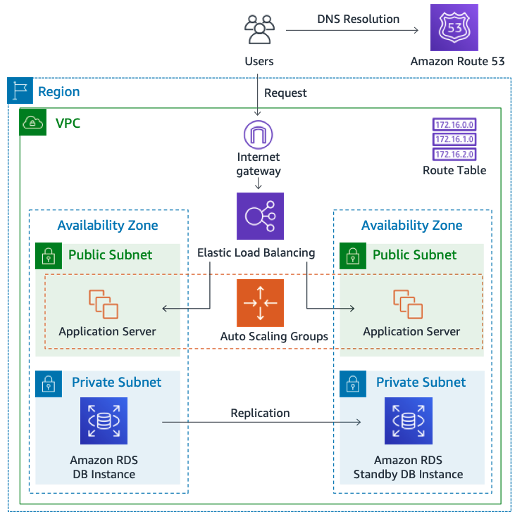

# AWS Cloud Migration for Horizon College Student Information System

## Overview

Designed a secure, highly available, and scalable AWS-based cloud architecture to modernize Horizon College's Student Information System (SIS). The project addresses challenges associated with disconnected systems, paper-based archives, on-premises file servers, and limited remote accessibility by migrating core services to AWS.

The solution combines multi-tier networking, serverless processing, managed database services, and cloud-native security controls to support enrollment management, digital archiving, centralized access, and future growth.

---

## Architecture

### High-Level Design

The environment is deployed within a dedicated Amazon VPC and follows a three-tier architecture:

- **Public Tier** – Application Load Balancer for secure internet-facing access
- **Application Tier** – Auto Scaling EC2 instances hosting the student portal
- **Data Tier** – Multi-AZ Amazon RDS database storing student records

Additional services include:

- Amazon S3 for document storage and archival
- AWS Lambda for event-driven enrollment processing
- AWS KMS for encryption
- CloudWatch and CloudTrail for monitoring and auditing
- AWS Backup for disaster recovery

---

## Project Objectives

- Migrate on-premises workloads to AWS
- Implement a centralized student information system
- Enable secure remote access for staff, students, and parents
- Improve availability and fault tolerance
- Establish a secure digital archive
- Reduce operational overhead through managed services
- Implement cloud security best practices

---

## AWS Services Used

### Networking

- Amazon VPC
- Public and Private Subnets
- Route Tables
- Internet Gateway
- NAT Gateway
- Security Groups
- VPC Endpoints

### Compute

- Amazon EC2
- Auto Scaling Groups
- Application Load Balancer

### Database

- Amazon RDS (MySQL Multi-AZ)

### Storage

- Amazon S3
- S3 Glacier Flexible Retrieval

### Serverless

- AWS Lambda
- S3 Event Notifications

### Security

- AWS IAM
- AWS KMS
- IAM Database Authentication

### Monitoring & Governance

- Amazon CloudWatch
- AWS CloudTrail
- AWS Backup

---

## Key Technical Features

### Multi-Tier VPC Architecture

Designed a segmented network architecture using dedicated public, application, and database subnets to enforce security boundaries and minimize attack surface.

### High Availability

Implemented Multi-AZ deployment strategies across application and database layers to improve resilience and support automatic failover.

### Event-Driven Processing

Developed a serverless workflow where new enrollment records uploaded to Amazon S3 automatically trigger AWS Lambda functions for processing and database updates.

### Secure Data Management

Implemented encryption at rest using AWS KMS and enforced least-privilege IAM policies across compute, storage, and database services.

### Observability

Integrated CloudWatch monitoring and CloudTrail auditing to provide operational visibility, troubleshooting capability, and compliance support.

---

## Migration Strategy

The migration plan follows a phased approach:

1. Assessment and Discovery
2. AWS Environment Setup
3. Infrastructure Deployment
4. Data Migration
5. Application Migration
6. Testing and Validation
7. Production Go-Live

Detailed documentation is available in:

- docs/migration-plan.md
- docs/security-design.md
- docs/cost-analysis.md

---

## Validation Activities

The architecture was validated through practical AWS implementation labs covering:

- VPC design and subnet segmentation
- EC2 deployment and Auto Scaling
- Application Load Balancer configuration
- RDS deployment and connectivity
- S3 storage and lifecycle policies
- Lambda event processing
- IAM access control implementation
- Monitoring and auditing configuration

---

## Security Highlights

- Least-privilege IAM access model
- Encryption using AWS KMS
- Private database deployment
- Security Group-based segmentation
- CloudTrail audit logging
- Automated backup strategy
- Multi-AZ fault tolerance

---

## Key Learning Outcomes

This project strengthened practical knowledge in:

- AWS networking and VPC design
- Cloud migration planning
- Infrastructure security
- High availability architectures
- Event-driven systems
- Disaster recovery and backup strategies
- Cloud governance and monitoring

---

## Future Improvements

Potential enhancements include:

- Infrastructure as Code using Terraform or CloudFormation
- CI/CD pipeline integration
- AWS WAF and Shield implementation
- VPN or Direct Connect hybrid connectivity
- Advanced observability and alerting
- Containerized workloads using Amazon ECS

---
